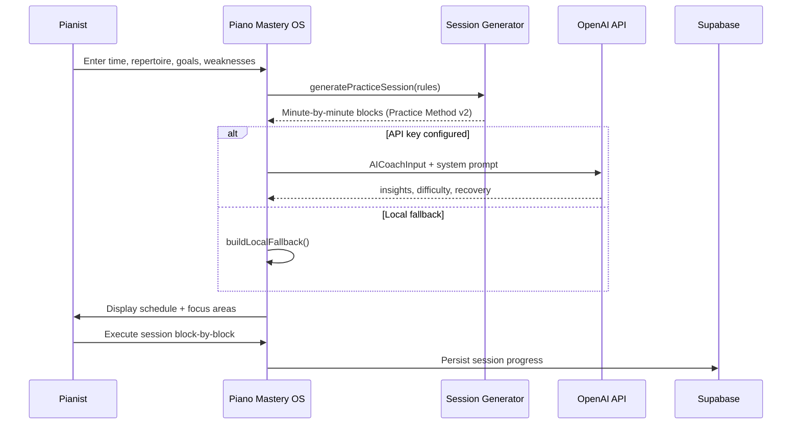

# AI Coaching Workflow

## Practice Plan Generation



## System Prompt Principles

The AI coach is constrained to Practice Method v2.0.0:

1. **One retrieval-sized Active Concept** — reject ecosystem-sized goals
2. **100-minute block structure** — scale proportionally if less time
3. **Identity keys before expansion** — 80/20 key distribution in month 1
4. **Sunday recording review is mandatory** — never optional
5. **Recovery periods** — injury prevention between high-load blocks
6. **Dual-task phase** — respect weekly phase decision (1→2→3)

## Recording Feedback Workflow

1. User records during Block 3 (Lab) or Block 4c (Trust Run)
2. Audio stored in Supabase Storage
3. User adds session notes / timestamps
4. On Sunday Block 5: batch review OR per-recording AI feedback
5. AI evaluates against **Sound Target Test** criteria:
   - Forced vs. natural deployment
   - Character fit for tune/context
   - Melodic distraction in worship settings
6. Feedback updates Device Backlog notes and next week's key focus

## Fluency Engine AI Rotation

```
IF exercise.stagnationWeeks >= 2 AND bpm_delta < 5:
  AI suggests rotation within category family
  Preserve metric focus (e.g., evenness → different pattern, same metric)
ELSE IF progress.data shows regression:
  AI suggests deload week (-10% BPM, +relaxation focus)
```

## Agility Engine AI

Input: repertoire piece + technical requirements + current tempo
Output: supporting exercise prescription with duration and BPM targets

Example: Toccata in E Minor → repeated notes endurance + cross-rhythm coordination, 8 min each, before repertoire work.

## Prompt Versioning (Production)

```
prompts/
  practice-plan-v2.0.0.txt
  recording-feedback-v1.0.0.txt
  fluency-rotation-v1.0.0.txt
```

Store `prompt_version` in session metadata for A/B testing coaching quality.
